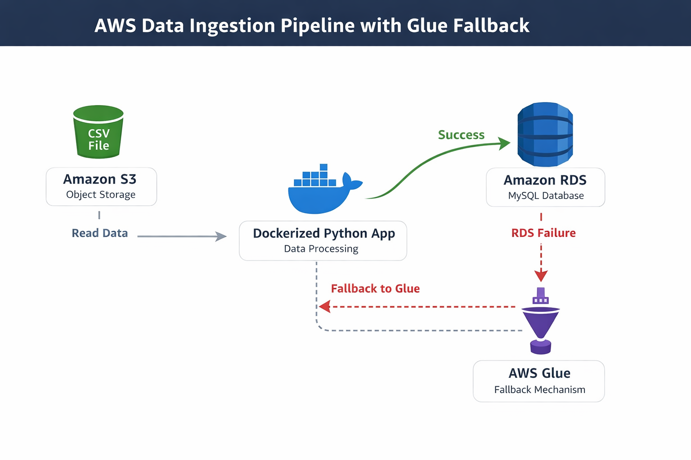

# S3 To RDS Data Ingestion Pipeline With Docker And AWS Glue Fallback

## Project Overview

This project demonstrates a cloud-based data ingestion pipeline built using AWS services and Docker. The pipeline reads a CSV dataset stored in Amazon S3, processes it using a Dockerized Python application, and loads the data into Amazon RDS.

If the RDS connection fails, the system triggers a fallback mechanism using AWS Glue.

## Architecture

     CSV File
       ↓
     Amazon S3 Bucket
       ↓
     Dockerized Python Application
       ↓
     Amazon RDS (MySQL Database)
       ↓
     Fallback → AWS Glue Data Catalog

## Technlogies Used

| Technology | Purpose                         |
| ---------- | ------------------------------- |
| Amazon S3  | Store CSV dataset               |
| Amazon EC2 | Run Docker container            |
| Docker     | Containerize Python application |
| Amazon RDS | Store processed data            |
| AWS Glue   | Data catalog fallback           |
| Python     | Data ingestion script           |
| Pandas     | Data processing                 |
| SQLAlchemy | Database connectivity           |

## Project Structure
    s3-rds-glue-project
    │
    ├── app.py
    ├── Dockerfile
    ├── requirements.txt
    └── README.md

### Sample CSV Dataset

     id   name
     1    Pooja
     2    Neha
     3    sonali
     4    Shraddha

## Python Workflow

The Python application performs the following steps:

- Connects to Amazon S3

- Reads the CSV dataset using Pandas

- Attempts to insert the data into Amazon RDS MySQL

- If the RDS insertion fails, the pipeline falls back to AWS Glue

### Python Environment Setup

Install Python dependencies required for the project.

    pip install boto3 pandas sqlalchemy pymysql cryptography

### Example requirements file:

     boto3
     pandas
     sqlalchemy
     pymysql
     cryptography

### AWS Credentials Setup

AWS credentials are required to allow the application to access Amazon S3 and AWS Glue.

Create access keys from AWS Identity and Access Management.

Steps:

1. Open AWS Console

2. Go to IAM

3. Select Users

4. Open Security Credentials

5. Click Create Access Key

## Amazon S3 Setup

Create a bucket in Amazon S3.

Example bucket:

    ec2tos3

Upload CSV dataset:

    data.csv

## Files

### 1. app.py

    import boto3
    import pandas as pd
    from sqlalchemy import create_engine

    # S3 configuration
    bucket_name = "data-integration-bucket-23"
    file_key = "data.csv"

    # RDS configuration
    db_user = "admin"
    db_password = "password"
    db_host = "your-rds-endpoint"
    db_name = "testdb"

    try:
    print("Reading file from S3...")

    s3 = boto3.client("s3")
    obj = s3.get_object(Bucket=bucket_name, Key=file_key)

    df = pd.read_csv(obj["Body"])

    print(df)

    print("Connecting to RDS...")

    engine = create_engine(
        f"mysql+pymysql://{db_user}:{db_password}@{db_host}/{db_name}"
    )

    df.to_sql("students", con=engine, if_exists="replace", index=False)

    print("Data inserted into RDS successfully")

    except Exception as e:
    print("RDS connection failed")
    print("Fallback to AWS Glue")
    print("Error:", e)

### 2.   requirements.txt
  
      boto3
     pandas
     sqlalchemy
     pymysql
     cryptography

### 3. Dockerfile

     FROM python:3.9
     WORKDIR /app
     COPY . /app
     RUN pip install --no-cache-dir -r requirements.txt
     CMD ["python", "app.py"]

## How to Run Project

### 1 Install Python Libraries

    pip install -r requirements.txt

### 2. Run Python Script

     python app.py

### 3. Build Docker Image

      docker build -t data-ingestion .

### 4. Run Docker Container

      docker run \
     -e AWS_ACCESS_KEY_ID=YOUR_ACCESS_KEY \
      -e AWS_SECRET_ACCESS_KEY=YOUR_SECRET_KEY \
     -e AWS_DEFAULT_REGION=ap-south-1 \
     data-ingestion

## Amazon RDS

### Create a MySQL database using Amazon RDS.

Configuration example:

      DB Engine: MySQL
      DB Instance: db.t3.micro
      Database Name: testdb
      Username: admin

    

### Install MariaDB

     sudo yum install mariadb105-server

### Connect to RDS from EC2:

     mysql -h <RDS-ENDPOINT> -u admin -p

### Create database:

    CREATE DATABASE testdb;

### Check tables:

    USE testdb;
    SHOW TABLES;

### Data Stored On RDS:

    select * From employee;

## AWS Glue Fallback

If the RDS connection fails, the application triggers a fallback message indicating that AWS Glue will be used.

Example output:

     Reading file from S3...
     Uploading data to RDS...
     RDS failed
      Fallback to AWS Glue

## Key Highlights

- Built a cloud-based data ingestion pipeline

- Integrated multiple AWS services

- Implemented Docker containerization for application deployment

- Automated data transfer from S3 to RDS

- Added fallback mechanism using AWS Glue

- Used Pandas for data processing

- Demonstrated real-world data engineering workflow

## Conclusion

This project demonstrates a cloud-native data ingestion pipeline integrating multiple AWS services. The system reads data from Amazon S3, processes it using a Dockerized Python application, and loads the results into Amazon RDS. A fallback mechanism ensures reliability by enabling AWS Glue when the primary database connection fails.

The architecture showcases real-world data engineering practices such as containerization, cloud storage integration, and fault-tolerant pipeline design.

## Author

mansi kadam

Aspiring DevOps Engineer | Cloud Computing Enthusiast 

Github: https://github.com/mansikadam1100
